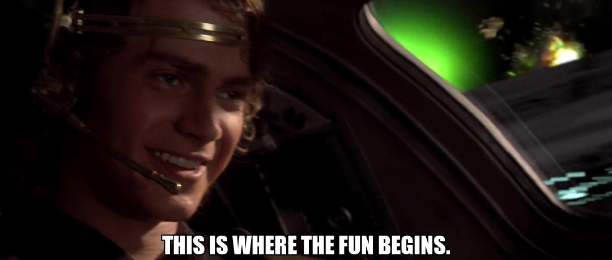
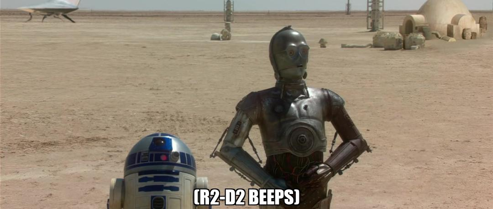

Movie Meme Generator
==========

This is an overengineered script for auto-generating image macro style "memes".
Inspired by Reddit's [/r/prequelmemes](https://reddit.com/r/prequelmemes) 
community, who believe that there every line in the Star Wars prequels can be a
meme, this script can pull screenshots from any movie and pair them with an 
associated subtitle to create a "meme".

Installation (Native)
-----

**Requirements** 

- [Pipenv](https://pipenv.readthedocs.io/en/latest/install/#installing-pipenv);  recommend not using Linuxbrew, but using one of the other options
- [FFmpeg](https://www.ffmpeg.org/) available in the command line as `ffmpeg`;
  install via your OS's distribution system

Dependency setup is handled by Pipenv, so all you have to do to install 
everything is:

    pipenv install

Usage (Native)
-----

Use the Pipenv environment to run the script, like this:

    $ pipenv run python movie-meme-generator.py 
    usage: movie-meme-generator.py [-h] [-m {interactive,script}] [-v | -q]
                                [--enable-imgur | --disable-imgur]
                                CONFIG_FILE

The execution of the script is configured via a YAML file. This repository
comes with a working sample file and "movie" with subtitles. You can see that
configuration in [`movie-meme-config.yaml`](./movie-meme-config.yaml), and the
movie/subtitle files in [`resources/`](./resources/).

You can run this sample configuration using:

    pipenv run python movie-meme-generator.py movie-meme-config.yaml

There is another sample configuration of what extracting memes from the Star
Wars prequel trilogy would look like, in 
[`sample-configs/star-wars.yaml`](./sample-configs/star-wars.yaml). The
actual movie/subtitle files are **not** provided; that's up beyond the scope
of this repo.

Usage (Docker)
-----

If you would rather not handle a local install of all that, and would rather
have it handled for you, a Docker configuration is included. Assuming you 
have set up Docker for your system already, all you have to do to 
generate memes is:

1. Place your movies/subtitles in the `resources/` directory
2. Edit [`movie-meme-config.yaml`](./movie-meme-config.yaml) to reference and
   use those files 
3. Run `./docker_build_run_script.sh`

Interactive mode is not supported with Docker, as it requires access to
your web browser.

Web Server (Docker)
-----

You can also stand up a simple web server that creates memes over and over:

1. Place your movies/subtitles in the `resources/` directory
2. Edit [`movie-meme-config.yaml`](./movie-meme-config.yaml) to reference and
   use those files 
3. Run `./docker_build_run_server.sh`
4. Find your server at `http://localhost:8080`

> If you want to run the server without Docker, you're on your own

